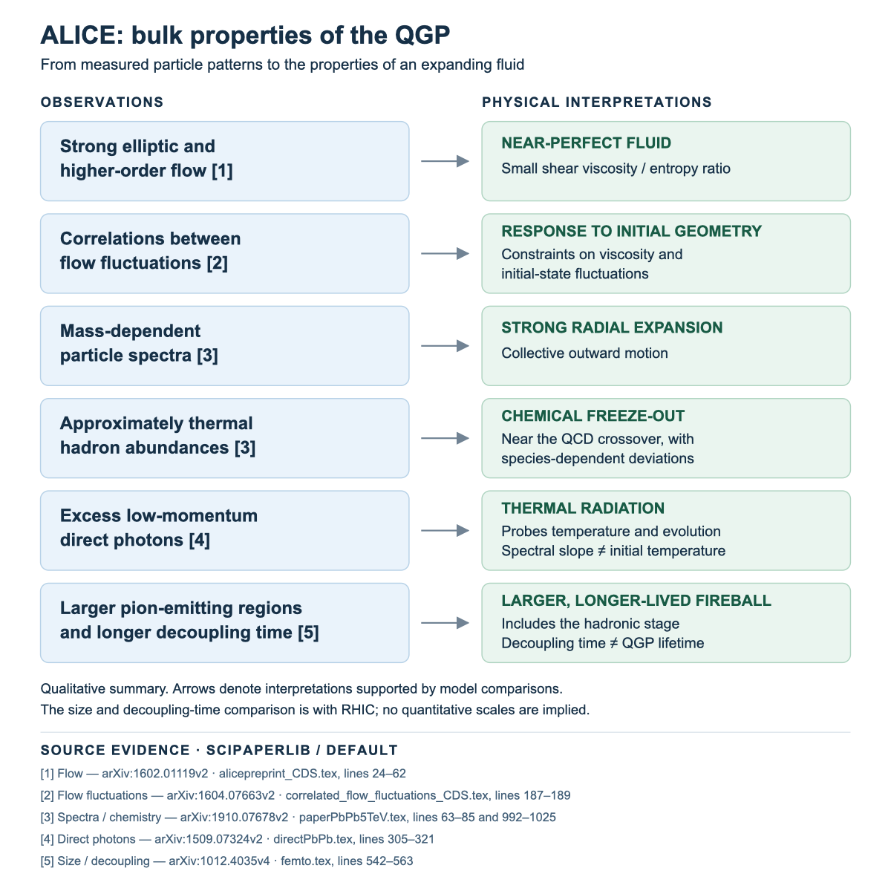

# SciPaperlib demo bundles

Demo bundles built from a SciPaperlib library, put together to show what an
automated literature-to-data pipeline can produce.

SciPaperlib is a local scientific literature and data library that works independently AND supplies *verifiable evidence to AI assistants through MCP*.

See [scipaperlib on PYPI](https://pypi.org/project/scipaperlib/)

## All the below was produced with a codex session

- session transcript sanitized below

<iframe src="2026-09-08-use-scipaperlib-for-a-one-paragraph.html" style="width:100%; height:800px; border:1px solid #ccc; border-radius:6px;" title="codex session"></iframe>

## ALICE QGP bulk observables

A flowchart summarizing ALICE bulk quark-gluon-plasma observables.

[View the vector version (SVG) →](alice-qgp-bulk/alice-qgp-bulk.svg)

## ALICE RAA summary explorer

An interactive nuclear-modification-factor explorer built from 65 HEPData
measurement curves (1,315 numeric points), covering light hadrons,
resonances, charm/beauty probes, charged/full/tagged jets and isolated
photons. Select presets or individual curves, filter by system/energy/object,
change the momentum range, toggle systematic errors, and export SVG/CSV/JSON.
Entirely self-contained — no installation, server or network needed.

<iframe src="alice-raa-summary/alice_raa_explorer.html" style="width:100%; height:800px; border:1px solid #ccc; border-radius:6px;" title="ALICE RAA explorer"></iframe>

[Open the explorer in its own tab](alice-raa-summary/alice_raa_explorer.html)

See the [full write-up](alice-raa-summary/README.md) and
[source catalogue](alice-raa-summary/SOURCES.md) for provenance, uncertainty
and axis policy, and validation notes.
